# Comparing lowCu EST with lowCu Proteomic Response
Anna A. Hippmann  
November 1, 2016  


I want to compare my EST expression data (log2) with my proteomics data of both TO03 and TO05
For lowCu, growth rate in the EST TO03 data has not been reduced significantly (have to double check the actual growthrates that were used) and plastocyanin has not been greatly reduced either. But I want to see the overall trend.

#Packages used:

```r
suppressPackageStartupMessages(library(dplyr)) # to help manipulating the data
suppressPackageStartupMessages(library(ggplot2))    # to help plotting the data
suppressPackageStartupMessages(library(gridExtra)) # to help plotting multiplot plots
suppressPackageStartupMessages(library(knitr))
suppressPackageStartupMessages(library(VennDiagram))
suppressPackageStartupMessages(library(tidyr))
suppressPackageStartupMessages(library(phytotools))
```

```
## Warning: package 'phytotools' was built under R version 3.2.5
```

```
## Warning: package 'insol' was built under R version 3.2.5
```

```
## Warning: package 'FME' was built under R version 3.2.5
```

```
## Warning: package 'deSolve' was built under R version 3.2.3
```

```
## Warning: package 'rootSolve' was built under R version 3.2.3
```

#Data Used:


```r
#EST
EST_lowCu <- read.delim("Input_Data/forR_2016_edgeR_lowCu_SOW_vs_ctrl_osp.txt", sep="\t")
EST_lowFe <- read.delim("Input_Data/forR_2015_edgeR_lowFe_SOW_vs_ctrl_osp.txt", sep="\t")

#TO03:
TO03_lowCu_Prot <- read.delim("Input_Data/Proteomics_TO03_lowCu_all.txt", sep="\t")
TO03_lowFe_Prot <- read.delim("Input_Data/Proteomics_TO03_lowFe_all.txt", sep="\t")

#TO05:
TO05_lowCu_Prot <- read.delim("Input_Data/Proteomics_TO05_lowCu_all.txt", sep="\t")
TO05_lowFe_Prot <- read.delim("Input_Data/Proteomics_TO05_lowFe_all.txt", sep="\t")


#Combined EST + TO03
Combined_EST_and_TO03_lowCu <- left_join(TO03_lowCu_Prot, EST_lowCu, by = "gene_ORF_id")
```

```
## Warning in left_join_impl(x, y, by$x, by$y): joining factors with different
## levels, coercing to character vector
```

```r
Combined_EST_and_TO03_lowFe <- left_join(TO03_lowFe_Prot, EST_lowFe, by = "gene_ORF_id")
```

```
## Warning in left_join_impl(x, y, by$x, by$y): joining factors with different
## levels, coercing to character vector
```

```r
#Combined EST + TO05
Combined_EST_and_TO05_lowCu <- left_join(TO05_lowCu_Prot, EST_lowCu, by = "gene_ORF_id")
```

```
## Warning in left_join_impl(x, y, by$x, by$y): joining factors with different
## levels, coercing to character vector
```

```r
Combined_EST_and_TO05_lowFe <- left_join(TO05_lowFe_Prot, EST_lowFe, by = "gene_ORF_id")
```

```
## Warning in left_join_impl(x, y, by$x, by$y): joining factors with different
## levels, coercing to character vector
```

```r
#Combined TO03 + TO05
Combined_TO03_and_TO05_lowCu <- left_join(TO03_lowCu_Prot, TO05_lowCu_Prot,  by = "gene_ORF_id")
```

```
## Warning in left_join_impl(x, y, by$x, by$y): joining factors with different
## levels, coercing to character vector
```

```r
Combined_TO03_and_TO05_lowFe <- left_join(TO03_lowFe_Prot, TO05_lowFe_Prot,  by = "gene_ORF_id")
```

```
## Warning in left_join_impl(x, y, by$x, by$y): joining factors with different
## levels, coercing to character vector
```


```r
#here is a cleanup code that gets rid of ggplots default background colours etc:
cleanup = theme (panel.grid.major = element_blank(),
                 panel.grid.minor = element_blank(),
                 panel.background = element_blank(),
                 axis.line = element_line(color = "black"))
```

#Plotting __lowCu__ Comparisons of Expression


```r
#now my  graphs:
#lowCu EST vs TO03
q <- ggplot(Combined_EST_and_TO03_lowCu, aes(x=Prot_log2_Ratio, y=logFC)) + 
  labs(title = bquote( atop("lowCu","Comparison Diff Expression EST" ~ italic(vs) ~ "Proteomic (TO03)")), y= bquote( log[2]~"EST (TO03)"), x = bquote (log[2] ~ "Proteomics (TO03)")) +
  geom_hline(aes(yintercept=1), colour="#BB0000", linetype="dashed") +
  geom_hline(aes(yintercept=-1), colour="#BB0000", linetype="dashed") +
  geom_vline(aes(xintercept=1), colour="#BB0000", linetype="dashed")+
  geom_vline(aes(xintercept=-1), colour="#BB0000", linetype="dashed")

(q1 <- q + geom_point())
```

```
## Warning: Removed 51 rows containing missing values (geom_point).
```

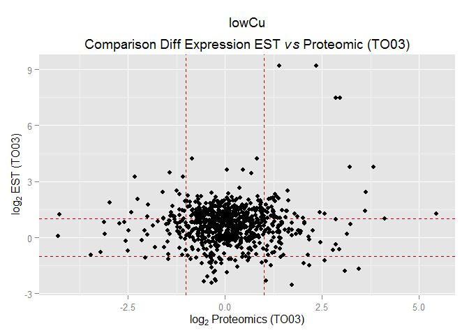 

```r
(q1b <- q1 + geom_smooth())
```

```
## geom_smooth: method="auto" and size of largest group is <1000, so using loess. Use 'method = x' to change the smoothing method.
```

```
## Warning: Removed 51 rows containing missing values (stat_smooth).
```

```
## Warning: Removed 51 rows containing missing values (geom_point).
```

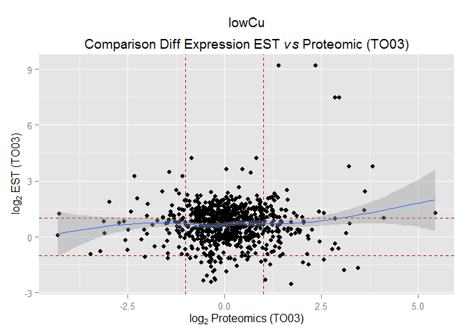 

```r
#lowCu EST vs TO05
q <- ggplot(Combined_EST_and_TO05_lowCu, aes(x=Prot_log2_Average, y=logFC)) + 
  labs(title = bquote( atop("lowCu","Comparison Diff Expression EST" ~ italic(vs) ~ "Proteomic (TO05)")), y= bquote( log[2]~"EST (TO03)"), x = bquote (log[2] ~ "Proteomics (TO05)")) +
  geom_hline(aes(yintercept=1), colour="#BB0000", linetype="dashed") +
  geom_hline(aes(yintercept=-1), colour="#BB0000", linetype="dashed") +
  geom_vline(aes(xintercept=1), colour="#BB0000", linetype="dashed")+
  geom_vline(aes(xintercept=-1), colour="#BB0000", linetype="dashed")

(q1 <- q + geom_point())
```

```
## Warning: Removed 106 rows containing missing values (geom_point).
```

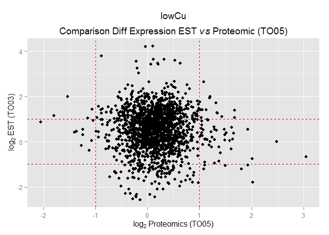 

```r
(q1b <- q1 + geom_smooth())
```

```
## geom_smooth: method="auto" and size of largest group is >=1000, so using gam with formula: y ~ s(x, bs = "cs"). Use 'method = x' to change the smoothing method.
```

```
## Warning: Removed 106 rows containing missing values (stat_smooth).
```

```
## Warning: Removed 106 rows containing missing values (geom_point).
```

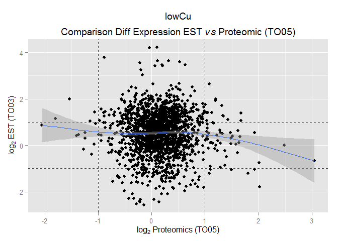 

```r
#lowCu TO03 vs TO05
q <- ggplot(Combined_TO03_and_TO05_lowCu, aes(x=Prot_log2_Average, y=Prot_log2_Ratio)) + 
  labs(title = bquote( atop("lowCu","Comparison Diff Expression Proteomic (TO03)" ~ italic(vs) ~ "Proteomic (TO05)")), y= bquote( log[2]~"Proteomics (TO03)"), x = bquote (log[2] ~ "Proteomics (TO05)")) +
  geom_hline(aes(yintercept=1), colour="#BB0000", linetype="dashed") +
  geom_hline(aes(yintercept=-1), colour="#BB0000", linetype="dashed") +
  geom_vline(aes(xintercept=1), colour="#BB0000", linetype="dashed")+
  geom_vline(aes(xintercept=-1), colour="#BB0000", linetype="dashed")

(q1 <- q + geom_point())
```

```
## Warning: Removed 79 rows containing missing values (geom_point).
```

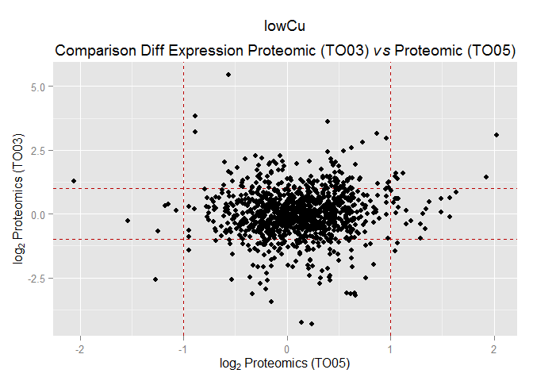 

```r
(q1b <- q1 + geom_smooth())
```

```
## geom_smooth: method="auto" and size of largest group is >=1000, so using gam with formula: y ~ s(x, bs = "cs"). Use 'method = x' to change the smoothing method.
```

```
## Warning: Removed 79 rows containing missing values (stat_smooth).
```

```
## Warning: Removed 79 rows containing missing values (geom_point).
```

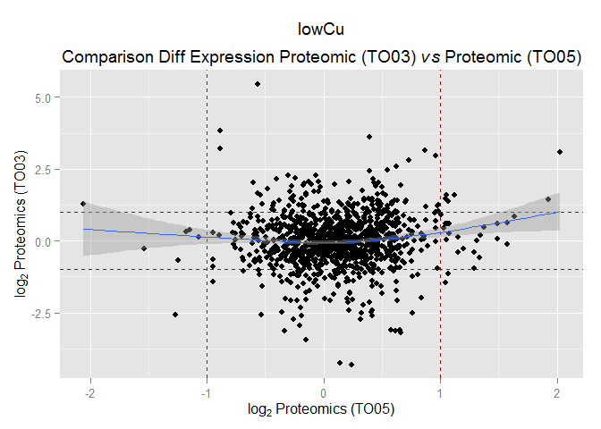 


```r
#now my  graphs:
#lowFe EST vs TO03
q <- ggplot(Combined_EST_and_TO03_lowFe, aes(x=Prot_log2_Ratio, y=logFC)) + 
  labs(title = bquote( atop("lowFe","Comparison Diff Expression EST" ~ italic(vs) ~ "Proteomic (TO03)")), y= bquote( log[2]~"EST (TO03)"), x = bquote (log[2] ~ "Proteomics (TO03)")) +
  geom_hline(aes(yintercept=1), colour="#BB0000", linetype="dashed") +
  geom_hline(aes(yintercept=-1), colour="#BB0000", linetype="dashed") +
  geom_vline(aes(xintercept=1), colour="#BB0000", linetype="dashed")+
  geom_vline(aes(xintercept=-1), colour="#BB0000", linetype="dashed")

(q1 <- q + geom_point())
```

```
## Warning: Removed 52 rows containing missing values (geom_point).
```

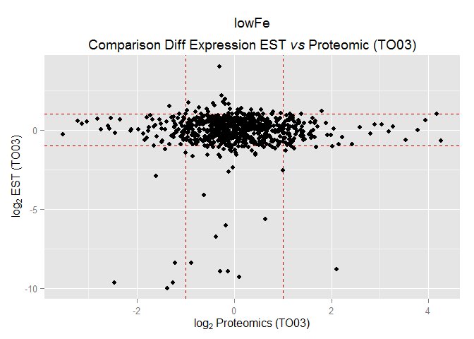 

```r
(q1b <- q1 + geom_smooth())
```

```
## geom_smooth: method="auto" and size of largest group is <1000, so using loess. Use 'method = x' to change the smoothing method.
```

```
## Warning: Removed 52 rows containing missing values (stat_smooth).
```

```
## Warning: Removed 52 rows containing missing values (geom_point).
```

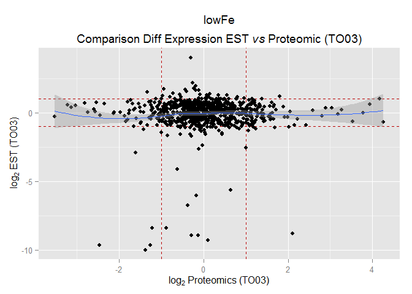 

```r
#lowFe EST vs TO05
q <- ggplot(Combined_EST_and_TO05_lowFe, aes(x=Prot_log2_Average, y=logFC)) + 
  labs(title = bquote( atop("lowFe","Comparison Diff Expression EST" ~ italic(vs) ~ "Proteomic (TO05)")), y= bquote( log[2]~"EST (TO03)"), x = bquote (log[2] ~ "Proteomics (TO05)")) +
  geom_hline(aes(yintercept=1), colour="#BB0000", linetype="dashed") +
  geom_hline(aes(yintercept=-1), colour="#BB0000", linetype="dashed") +
  geom_vline(aes(xintercept=1), colour="#BB0000", linetype="dashed")+
  geom_vline(aes(xintercept=-1), colour="#BB0000", linetype="dashed")

(q1 <- q + geom_point())
```

```
## Warning: Removed 96 rows containing missing values (geom_point).
```

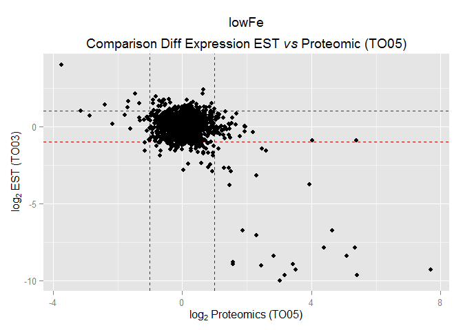 

```r
(q1b <- q1 + geom_smooth())
```

```
## geom_smooth: method="auto" and size of largest group is >=1000, so using gam with formula: y ~ s(x, bs = "cs"). Use 'method = x' to change the smoothing method.
```

```
## Warning: Removed 96 rows containing missing values (stat_smooth).
```

```
## Warning: Removed 96 rows containing missing values (geom_point).
```

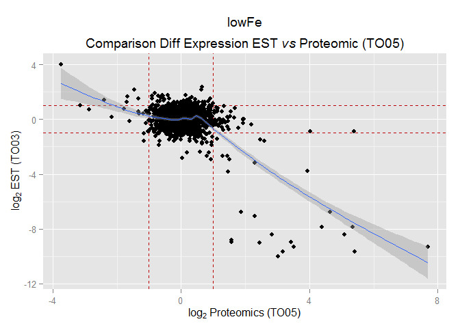 

```r
#lowFe TO03 vs TO05
q <- ggplot(Combined_TO03_and_TO05_lowFe, aes(x=Prot_log2_Average, y=Prot_log2_Ratio)) + 
  labs(title = bquote( atop("lowFe","Comparison Diff Expression Proteomic (TO03)" ~ italic(vs) ~ "Proteomic (TO05)")), y= bquote( log[2]~"Proteomics (TO03)"), x = bquote (log[2] ~ "Proteomics (TO05)")) +
  geom_hline(aes(yintercept=1), colour="#BB0000", linetype="dashed") +
  geom_hline(aes(yintercept=-1), colour="#BB0000", linetype="dashed") +
  geom_vline(aes(xintercept=1), colour="#BB0000", linetype="dashed")+
  geom_vline(aes(xintercept=-1), colour="#BB0000", linetype="dashed")

(q1 <- q + geom_point())
```

```
## Warning: Removed 78 rows containing missing values (geom_point).
```

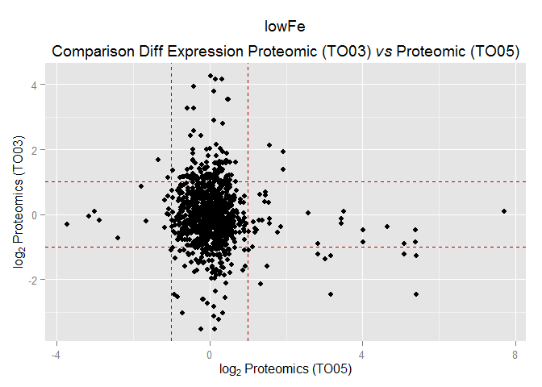 

```r
(q1b <- q1 + geom_smooth())
```

```
## geom_smooth: method="auto" and size of largest group is >=1000, so using gam with formula: y ~ s(x, bs = "cs"). Use 'method = x' to change the smoothing method.
```

```
## Warning: Removed 78 rows containing missing values (stat_smooth).
```

```
## Warning: Removed 78 rows containing missing values (geom_point).
```

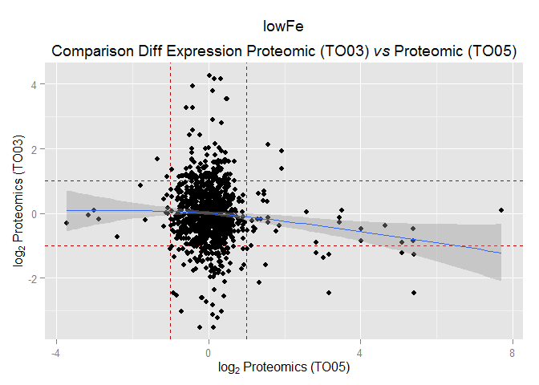 
