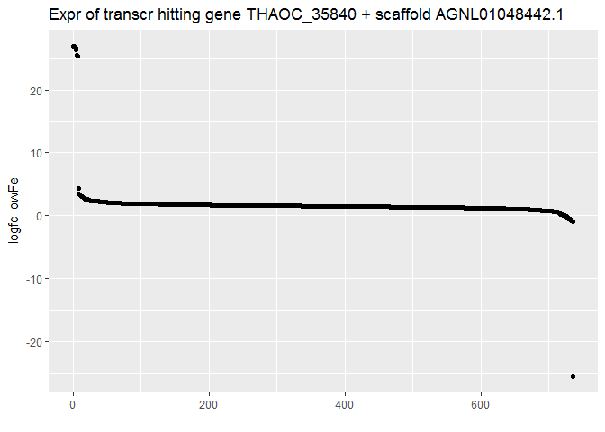
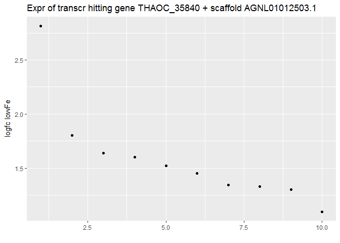
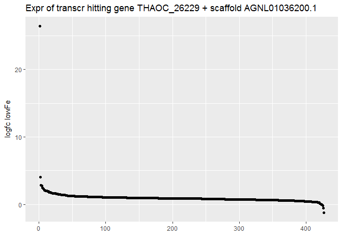
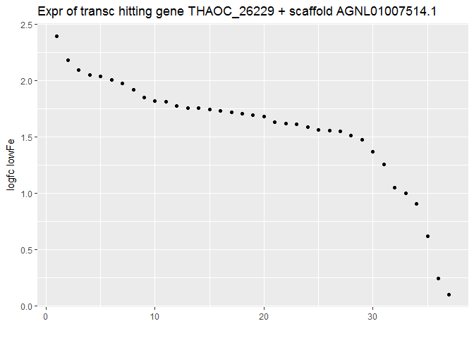
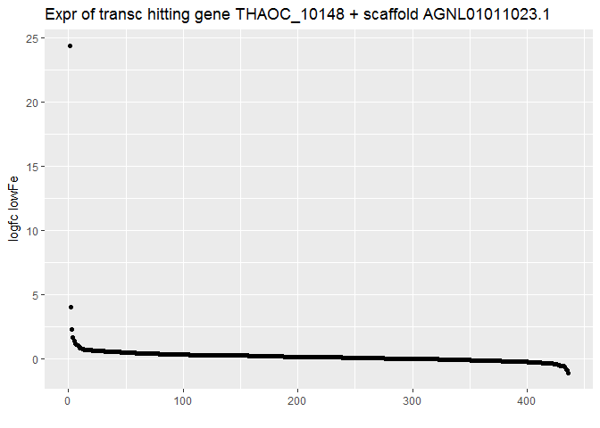
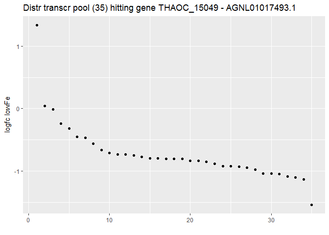

# 2_Exploring_EST_Denovo_Data
Anna A. Hippmann  
February 3, 2017  


### Exploring EST de novo data

What I would like to do here is explore the denovo data a bit and getting some feel of the subversiveness of redundancies and how we might need to deal with them. The information that we do have about each transcript is if it:

* hits a predicted reference gene on the genome of _T. oceanica_ (CCMP 1005) ( __gene__)

* hits the chloroplast genome ( __chl__)

* hits any non-coding part of the genome ( __genome__)

* hits nothing on the genome ( __not__)

What I would like to explore in more detail

1) What is the proportion of each of the above defined 4 pools (i.e. ORF, chl, gene, not)

2) how much redundencies are there (i.e. in ORF and chl pool, how many transcripts are hitting the same reading frame?) 
  - Those transcripts that are hitting the same genes will be dubbed to belong the same __pool__ of transcripts
  
3) are the redundant transcripts of one pool expressed in a similar way or are there __sub-pools__ of expression

####Why do I want to know/deal with the redundancies?

With my proteomics data I would like to investigate the proteomic response of _T. oceanica_ (CCMP 1003) to low Cu. At the moment I am particularly looking into the carbon metabolism. Earlier work, especially by Allen et al, Gruber et al and Smith et al, has shown that many metabolic pathways include several isozymes that are often times targeted to different cellular subcompartments. Furthermore some are used within the whole cellular metabolism in differnet ways than we would find in plants or animals. All of this makes it crucial to know where a  protein is really targeted to.

_T. oceanica's_ publicly available genome is helpful. However, it is in a rather rudimentary _Scaffold_ state when compared to the golden standard of genomes such as _T. pseudonanas_ or _P. tricornutums_. Oftentimes, gene models in _T. oceanica_ are missing their target sequence. THe EST library could help enhance the current gene models, especially upstream of the genes of interest to me to allow a beeter cellular targeting prediction.


##Libraries used

```r
suppressPackageStartupMessages(library(visreg))
suppressPackageStartupMessages(library(dplyr))
library(tidyr)
library(ggplot2)
library(knitr)
#library (gridExtra)
#library(cowplot)
```


```r
EST_all <- read.delim("Input_Data/T.oceanica_annotation_denovo_2015.txt") #these are 145,068 transcripts!

EST_small <- EST_all %>% 
  select(1:9) %>% 
  rename(transcript = orf_id, ref_gene=ref_gene_id, ref_scaffold = ref_genome_id) %>% 
  mutate(transcr_length = ref_genome_end - ref_genome_start)


names(EST_small)
```

```
##  [1] "transcript"         "orig.orf_id_row."   "hitting"           
##  [4] "ref_gene"           "ref_scaffold"       "ref_genome_start"  
##  [7] "ref_genome_end"     "orf_contam_type"    "AnnotationCombined"
## [10] "transcr_length"
```

```r
EST_2013_expression <- read.delim("Input_Data/2013_denovo_transcript_expression_Toceanica_annotations_counts_stats_v4.txt")
#these are only 120,281

EST_2013_expression_short <- EST_2013_expression %>% 
  rename(transcript = orf.id, logfc_lowFe = edgeR_logfc_low_Fe_high_Cu_vs_high_Fe_high_Cu, fdr_lowFe = edgeR_fdr_low_Fe_high_Cu_vs_high_Fe_high_Cu) %>% 
select(1:10, logfc_lowFe, fdr_lowFe)
      
EST_with_Expression <- inner_join(EST_small, EST_2013_expression_short, by = "transcript") #so all but one is also part of the 2015 transcript set.
```

```
## Warning in inner_join_impl(x, y, by$x, by$y, suffix$x, suffix$y): joining
## factors with different levels, coercing to character vector
```

```r
#I will not investigate further at htis point what is going on with the 25,000 additional transcripts in the 2015 d
```
####Now I would like to have a summary of each column


```r
#counts the number of disinct values in each variable
(summary_EST <- EST_with_Expression %>% 
  summarise_each(funs(n_distinct)))
```

```
##   transcript orig.orf_id_row. hitting ref_gene ref_scaffold
## 1     120280           120280       4    21226        17316
##   ref_genome_start ref_genome_end orf_contam_type AnnotationCombined
## 1            12117          12848             558              18684
##   transcr_length locus.for.REFseq.MeV.file..chr123.start.end. strand
## 1           3556                                       120280      2
##   orf.length contig.length orf.mapped.to.genes
## 1       1560          4112                   2
##   orf.mapped.to.nuclear_genome orf.mapped.to.chloroplast_genome
## 1                            2                                2
##   best.kegg.hit kegg.description logfc_lowFe fdr_lowFe
## 1         19343             8689       89183     37853
```

```r
summary_gene <- EST_with_Expression %>% 
  group_by(ref_gene) %>% 
  summarise(n()) %>% 
  rename(count = `n()` ) %>% 
  arrange(desc(count))

kable((head(summary_gene)), format = "markdown")
```


|ref_gene    | count|
|:-----------|-----:|
|            | 40262|
|THAOC_35840 |   748|
|THAOC_26229 |   486|
|THAOC_10148 |   437|
|THAOC_17662 |   397|
|THAOC_07365 |   368|

### THAOC_35840 - sterol regulatory element-binding protein, partial

Lets have a closer look at [THAOC_35840](https://www.ncbi.nlm.nih.gov/protein/397567357).

As per NCBI, this gene is putatively a "sterol regulatory element-binding protein, partial". It is hit by 748  transcripts (sidenote in an earlier version where I used the 2015 dataset, it was hit y 757 transcripts....)

```r
THAOC_35840 <- EST_with_Expression %>% 
  filter(ref_gene == "THAOC_35840")
```

So, the transcript_pool for THAOC_35840 consiste of 748 trancripts.

As mentioned above, the state of the officially available TO genome is still in the scaffold phase. And the scaffolds harbouring usually 1-2 predicted proteins only. When we look at our data, we see in the summary, that the transcripts hit 21226 ref_genes and 17316 reference scaffolds.

When we look our THAOC_35840 transcript pool, they all hit the same reference gene, but when we look at the scaffolds, they hit combined 4 different scaffolds. How can this be? This is due to the fact that one was aligned in aminoacid space and the other one in nucleotide space. I would like to have a look now at how the transcript length might come into play. Here is a summary table of the 757 transcripts and how they are __distributed__ between the scaffolds. Furthermore, each scaffold sub-pool has information on the mean, median, min, and max transcript length.


```r
THAOC_35840_subpool_sum <- THAOC_35840 %>% 
  group_by(ref_scaffold) %>% 
  summarise(transcr_number = n_distinct(transcript), mean_length = mean(transcr_length), min_length = min(transcr_length), max_length = max(transcr_length), median_length = median(transcr_length))

kable((THAOC_35840_subpool_sum), format="markdown")
```


|ref_scaffold                                        | transcr_number| mean_length| min_length| max_length| median_length|
|:---------------------------------------------------|--------------:|-----------:|----------:|----------:|-------------:|
|gi&#124;397567356&#124;gb&#124;AGNL01048442.1&#124; |            736|    215.4728|         77|        550|           209|
|gi&#124;397577873&#124;gb&#124;AGNL01043102.1&#124; |              1|    215.0000|        215|        215|           215|
|gi&#124;397625615&#124;gb&#124;AGNL01012503.1&#124; |             10|    200.3000|        197|        203|           200|
|gi&#124;397647541&#124;gb&#124;AGNL01000460.1&#124; |              1|    207.0000|        207|        207|           207|
-And now I would like to look at the expression / regulation of all of these transcripts:

```r
scaffold <-    THAOC_35840 %>% 
  filter(ref_scaffold == "gi|397567356|gb|AGNL01048442.1|") %>% 
  arrange(desc(logfc_lowFe)) %>% 
  mutate(rank = 1:736)

p <- ggplot(scaffold, aes(x=rank, y = logfc_lowFe ))

p <- p + geom_point()+
  labs(title="Expr of transcr hitting gene THAOC_35840 + scaffold AGNL01048442.1 ", x ="", y= "logfc lowFe")


suppressMessages(p)
```

<!-- -->

<!-- -->


Let's do the same thing with the next two biggest transcript pools: [THAOC_26229](https://www.ncbi.nlm.nih.gov/protein/397588262) and [THAOC_10148](https://www.ncbi.nlm.nih.gov/protein/397627888)

### THAOC_26229 - non-ribosomal peptide synthetase 


|ref_scaffold                                        | transcr_number| mean_length| min_length| max_length| median_length|
|:---------------------------------------------------|--------------:|-----------:|----------:|----------:|-------------:|
|gi&#124;397588259&#124;gb&#124;AGNL01036200.1&#124; |            427|    208.2927|         62|        419|           206|
|gi&#124;397633941&#124;gb&#124;AGNL01007514.1&#124; |             37|    200.2162|         65|        265|           203|
|gi&#124;397635852&#124;gb&#124;AGNL01006442.1&#124; |             15|    207.2000|         74|        245|           209|
|gi&#124;397618424&#124;gb&#124;AGNL01016720.1&#124; |              3|    139.0000|         95|        215|           107|
|gi&#124;397563911&#124;gb&#124;AGNL01050338.1&#124; |              2|    227.0000|        197|        257|           227|
|gi&#124;397570384&#124;gb&#124;AGNL01047146.1&#124; |              1|    209.0000|        209|        209|           209|
|gi&#124;397632060&#124;gb&#124;AGNL01008593.1&#124; |              1|    231.0000|        231|        231|           231|

```r
scaffold <-    THAOC_26229 %>% 
  filter(ref_scaffold == "gi|397588259|gb|AGNL01036200.1|") %>% 
  arrange(desc(logfc_lowFe)) %>% 
  mutate(rank = 1:427)

p <- ggplot(scaffold, aes(x=rank, y = logfc_lowFe ))

p <- p + geom_point()+
  labs(title="Expr of transcr hitting gene THAOC_26229 + scaffold AGNL01036200.1", x ="", y= "logfc lowFe")


suppressMessages(p)
```

<!-- -->

<!-- -->


### THAOC_10148 - hypothetical protein

|ref_scaffold                                        | transcr_number| mean_length| min_length| max_length| median_length|
|:---------------------------------------------------|--------------:|-----------:|----------:|----------:|-------------:|
|gi&#124;397627885&#124;gb&#124;AGNL01011023.1&#124; |            436|    206.1353|         77|        386|           203|
|gi&#124;397608269&#124;gb&#124;AGNL01021940.1&#124; |              1|    200.0000|        200|        200|           200|
<!-- -->


##THAOC_15049 - hypothetical protein -> aminotransferase

I am interested in [THAOC_15049](https://www.ncbi.nlm.nih.gov/protein/397617000) as it is one of these proteins that is sig upregulated under lowCu (in my proteomics data)


|ref_scaffold                                        | transcr_number| mean_length| min_length| max_length| median_length|
|:---------------------------------------------------|--------------:|-----------:|----------:|----------:|-------------:|
|gi&#124;397616999&#124;gb&#124;AGNL01017493.1&#124; |             35|    215.9429|         77|        896|           209|
<!-- -->
